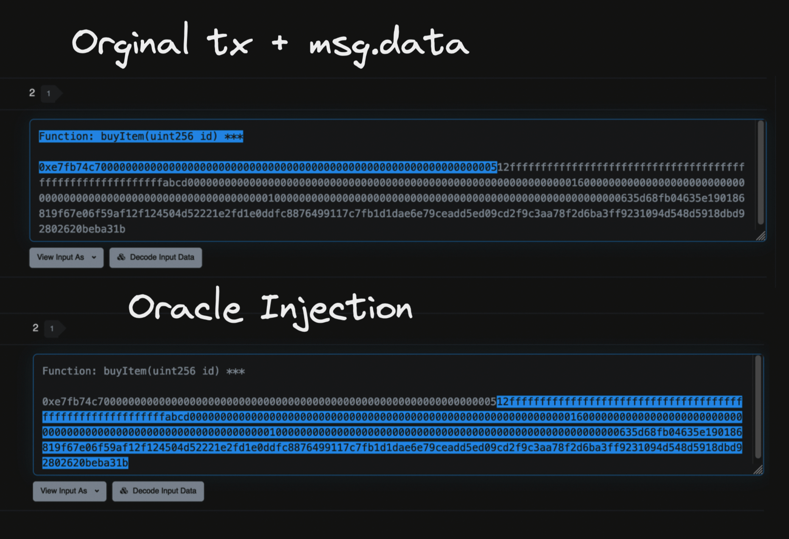

### ETHLisbon Hackathon Project

#  Data3 - Oracle Injection

An on-demand Web3 trusted off-chain data provided.
Signed and trusted data is attached to the end of the original msg.data
by the ethersjs or web3js data3 extension.

- chain-agnostic, 
- multi-modular, 
- cheap Oracle

why? On-chain data storage is expensive!!!

##  How it works?

##  How data is injected?

# Modules

## Whitelist3:
- on-demand dynamic whitelisting
- ML/AL off-chain analyzer that detects wallet connections
and blocks Sibling wallets

### Example use cases:
- NFT mint with fair distribution to not connected wallets 

## Score3:
- off-chain assessment of creditworthiness based 
on bank statements, employment, and earnings.
- a "degen" crypto score provider, from collected  
user on-chain activity 

### Example use cases:
- lending protocol with off-chain collateralization, and guaranties 
of repayments. Off-chain Score3 partners (lenders validators)
- landing protocol with under collateralization for best dagens

## Kyc3:
- trusted and anonymous way to prove the user is verified
- provides:
    - zk-proof of the identity
    - age
    - country
    - validation timestamp

### Example use case:
- crowdfunding/launchpad projects that need to verify 
if the user is not from a restricted country. Ex. Russia\Iran
- B2B exchanges
- online shop/content provider for adults with anonymity
for payments
